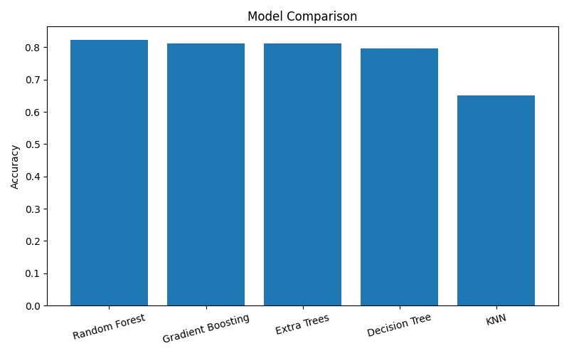
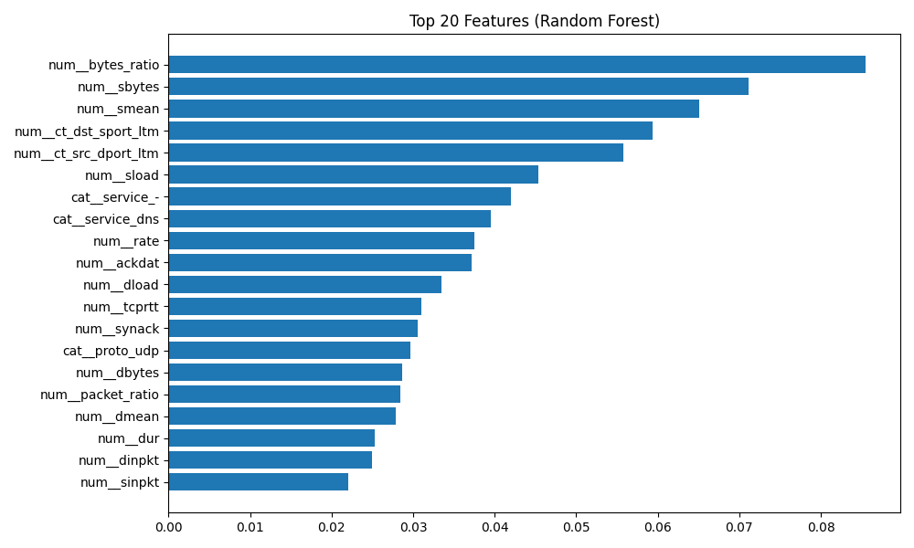
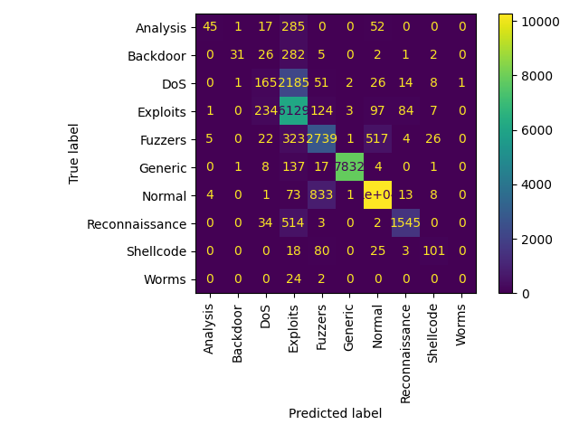

# Advanced AI for Cybersecurity

Intrusion Detection System using Machine Learning on UNSW-NB15 Dataset.

## Project Overview

This project compares multiple machine learning algorithms for network intrusion detection.

Dataset:
- UNSW-NB15

Models:
- Decision Tree
- Random Forest
- Extra Trees
- KNN
- Gradient Boosting

## Results

| Model | Accuracy |
|---------|---------|
| Random Forest | 82.28% |
| Gradient Boosting | 81.24% |
| Extra Trees | 81.22% |
| Decision Tree | 79.73% |
| KNN | 65.04% |

Best Model:
- Random Forest

## Feature Engineering

Additional features:

- bytes_ratio
- packet_ratio

## Visualizations

### Model Comparison

### Feature Importance

### Confusion Matrix

## Technologies

- Python
- Pandas
- Scikit-Learn
- Matplotlib

## Author

Kankrit